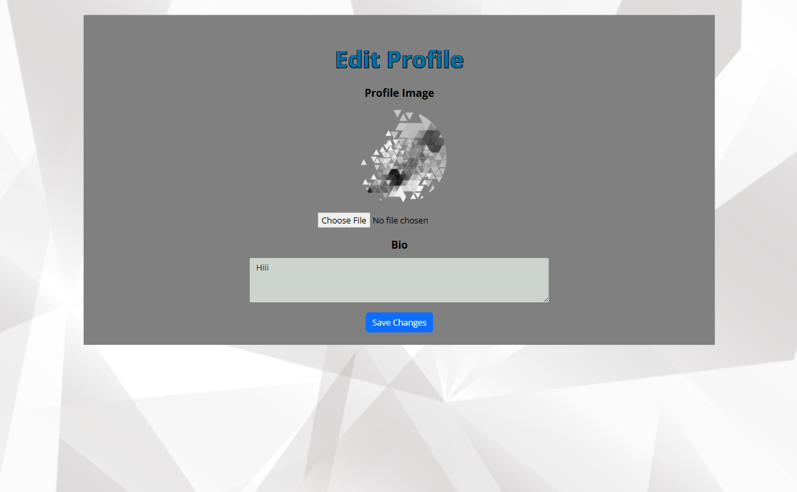

# Task Pilot
Task Pilot is a Ticket orientated application built for small to medium size business departments for managing responsibilities as a team. 

- The repository for the Task-Pilot-API associated with this project is available [HERE](https://github.com/Blaize-Egelhof/task-pilot-api). The installation, set up, and deployment steps for this section of the project have also been included in the README linked to the DRF-API. 

#### DEPLOYED BACKEND API RENDER [LINK](https://task-pilot-api-323c9bc2bc87.herokuapp.com/)
#### DEPLOYED FRONTEND RENDER [LINK - LIVE SITE](https://task-pilot-e84398da7501.herokuapp.com/)
#### DEPLOYED BACKEND GITHUB [REPOSITORY](https://github.com/Blaize-Egelhof/task-pilot-api?tab=readme-ov-file)


The live link for "Task Pilot" can be found [HERE](https://task-pilot-e84398da7501.herokuapp.com/)

## Table of Contents
+ [UX](#ux "UX")
  + [Site Purpose](#site-purpose "Site Purpose")
  + [Site Goal](#site-goal "Site Goal")
  + [Audience](#audience "Audience")
  + [Communication](#communication "Communication")
  + [Current User Goals](#current-user-goals "Current User Goals")
  + [New User Goals](#new-user-goals "New User Goals")
+ [User Stories](#user-stories "User Stories")
+ [Design](#design "Design")
  + [Colour Scheme](#colour-scheme "Colour Scheme")
  + [Typography](#typography "Typography")
  + [Imagery](#imagery "Imagery")
+ [Features](#features "Features")
  + [Existing Features](#existing-features "Existing Features")
  + [C.R.U.D](#crud "C.R.U.D")
+ [Testing](#testing "Testing")
  + [Validator Testing](#validator-testing "Validator Testing")
  + [Unfixed Bugs](#unfixed-bugs "Unfixed Bugs")
+ [Technologies Used](#technologies-used "Technologies Used")
  + [Main Languages Used](#main-languages-used "Main Languages Used")
  + [Frameworks, Libraries & Programs Used](#frameworks-libraries-programs-used "Frameworks, Libraries & Programs Used")
+ [Components](#components "Components")
+ [Deployment](#deployment "Deployment")
+ [Credits](#credits "Credits")
  + [Content](#content "Content")
  + [Media](#media "Media")

## UX

### Site Purpose:
To inspire collaboration as a team in order to accomplish high difficulty Tasks / Serve as a personal Task organiser.

### Site Goal:
Inspire Collaboration , Teamwork and goal organisation for a person/'s or Organisation.

### Audience:
Anyone looking to resolve complex issues .

### Communication:
The layout is intended to represent a modern vibe, whilst at the same time having an informal feel. With the navigation panel being present at all times, the users can quickly navigate through the site to arrive at their intended destination.
This Application also has a notifcation feature in order to alert users of any state change or invite changes relating to Tasks.

### Current User Goals:
To keep users utlizing my site in order to attain further answers to Tasks or review previously answered Tasks

### New User Goals:
To engage the user in a meaningful way, and encourage them to contribute to Tasks.

### Future Goals:
- Ability to search for different Tasks according to state and ownership in order to attain answers to other Tasks site users have previously solved.
- Provide the ability for users to send private messages to either another user, or a group of users.
- Ability to verify users qualifications and contributions in order to verify weither a specific user can be marked as 'TrustWorthy' for specific Task category contributions

## User Stories
I have included links to the [GitHub Issues](https://github.com/Blaize-Egelhof/task-pilot/issues) for this project, as well as the [KANBAN board](https://github.com/users/Blaize-Egelhof/projects/3).

Please also find a full list of the Epics, User stories, & story points typed up [HERE](https://github.com/Blaize-Egelhof/task-pilot-api/blob/main/static/userstories.md).

## Design

### Wireframes:

##### Home Page - Desktop: 


##### Home Page - Mobile: 


##### Inbox Page:


##### Create Task:


##### View Task:


##### Edit Task:


##### SignUp:


##### Login:


### Database Schema:
This has been uploaded to the Backend README, which can be found [HERE](https://github.com/Blaize-Egelhof/task-pilot-api).

### Colour Scheme:


In order from left to right : 

#343a40 (Dark Gray): A strong, modern dark gray that provides a solid foundation and contrast.

#0071a6 (Blue): A vibrant blue that adds a pop of color and liveliness, creating a focal point in the design.

#ccd3cd (Light Gray): A subtle, light gray that offers a gentle contrast and balances the darker tones.

#808080 (Gray): A neutral gray that serves as a versatile background, ensuring readability and a clean look.

### Typography:
I've chosen this color palette because the colors complement each other while providing subtle contrast when used in the correct order. The theme aims to be modern yet easy on the eyes, ensuring an aesthetically pleasing and user-friendly experience.

## Features

### Existing Features:

#### About Page - Desktop:


#### About Page - Mobile:


#### Header/Navigation - Desktop:


#### Header/Navigation - Mobile:


#### Home Page Navigation - Desktop:


#### Home Page Navigation -Mobile:


#### Task View - Desktop:


#### Task View - Mobile:


#### Edit Task - Desktop:


#### Edit Task - Mobile:


#### Create Task - Desktop:


#### Create Task - Mobile:


#### Create Message Send - Desktop:


#### Create Message Send - Mobile:


#### Profile View - Desktop:


#### Profile View - Mobile:


#### Profile Edit - Desktop:



#### Profile Edit - Mobile:


#### 404 - Desktop:


#### 404 - Mobile:


#### Log in, Log out & Sign up:

##### Login - Desktop:


##### Login - Mobile:


##### Logout - Desktop:


##### Logout - Mobile:


##### Sign-up - Desktop:


##### Sign-up - Mobile:


### Features Left to Implement:
- Inbox for each user to be able to recieve task invitations to accept or decline and also for notifications regarding a Task being marked as completed.
- Ability to display all public tasks created and joined via a list when viewing a profile.
- Infinite scroll for Task Messages.
- A more indepth search option to search for tasks by any criteria 
- Ability for Task admin's to pin a users comment which has solved the task's topic.
- Ability to send private messages to users.
- Ability to block users 

## Testing

### Manual Testing:
| **ID** | **CATEGORY**      | **TEST**                                | **ACTION**                                               | **EXPECTATION**                                                        | **RESULT** |
|--------|-------------------|-----------------------------------------|----------------------------------------------------------|------------------------------------------------------------------------|------------|
| T1     | **Authentication**| Sign Up - Success                       | Sign up with valid credentials                           | User receives notification: "Account created successfully. Please sign in." and is redirected to sign in page                     | ✅         |
| T2     | **Authentication**| Sign Up - Invalid Fields                | Sign up with invalid username or password                | User receives notification: "Invalid username or password fields."    | ✅         |
| T3     | **Authentication**| Sign In - Success                       | Sign in with correct credentials                         | User is redirected to Home Page and welcomed                           | ✅         |
| T4     | **Authentication**| Sign In - Invalid Credentials           | Sign in with incorrect username or password             | User receives notification: "Invalid Credentials provided."            | ✅         |
| T5     | **Authentication**| Logout Confirmation                     | Click on logout button                                   | Modal pops up asking "Are you sure you want to sign out?"               | ✅         |
| T6     | **Authentication**| Logout - Confirm Sign Out               | Click "Yes" in logout confirmation modal                 | User is signed out and redirected to the sign in page                  | ✅         |
| T7     | **Accessibility** | Access Home Page after Logout           | Attempt to access home page after logging out            | User is redirected to the sign in page                                 | ✅         |
| T8     | **Accessibility** | Access Protected Components             | Attempt to access any component without logging in       | User is redirected to the sign in page                                 | ✅         |
| T9     | **Task Management**| Create Task - Success                   | Successfully create a task                               | User is redirected to Home Page and receives notification: "Task created successfully."                                              | ✅         |
| T10    | **Task Management**| Create Task - Invalid Fields            | Submit create task form with invalid data                | User receives specific error message related to the invalid field      | ✅         |
| T11    | **Task Filtering**| Filter Tasks - All                     | View all tasks owned or joined                           | All tasks owned or joined by the user are displayed                     | ✅         |
| T12    | **Task Filtering**| Filter Tasks - Owned Tasks             | Select 'Owned Tasks' filter                              | Only tasks owned by the user are displayed                              | ✅         |
| T13    | **Task Filtering**| Filter Tasks - Joined Tasks            | Select 'Joined Tasks' filter                             | Only tasks where the user is a member (but not owner) are displayed      | ✅         |
| T14    | **Task Filtering**| Filter Tasks - Closed Tasks            | Select 'Closed Tasks' filter                             | Only tasks that are closed (completed or archived) are displayed          | ✅         |
| T15    | **Task Badges**   | Display Ownership Badge               | View tasks on home page                                  | Tasks owned by the current user display 'Owned' badge                    | ✅         |
| T16    | **Task Badges**   | Display Membership Badge              | View tasks on home page                                  | Tasks where the current user is a member display 'Member' badge           | ✅         |
| T17    | **Task Badges**   | Display Overdue Badge                 | View tasks on home page                                  | Tasks overdue (due date exceeds current date) display 'Overdue' badge      | ✅         |
| T18    | **Task Editing**  | Edit Task - Owned Task                 | View task owned by the current user                       | 'Edit' button is displayed, click redirects to pre-populated edit form    | ✅         |
| T19    | **Task Editing**  | Edit Task - Non-Owned Task             | View task not owned by the current user                   | 'Edit' button is not displayed, attempting to access edit form redirects to home page | ✅         |
| T20    | **Task Editing**  | Modify Task - Valid Fields             | Edit task with valid data                                | Task details are updated, user is redirected to home page with success message | ✅         |
| T21    | **Task Editing**  | Modify Task - Invalid Fields           | Edit task with invalid data                              | Error message is displayed for specific field, prompting user to correct it  | ✅         |
| T22    | **Task Editing**  | Delete Task Confirmation               | Click on 'Delete' button                                 | Modal pops up asking "Are you sure you want to delete this task?"          | ✅         |
| T23    | **Task Editing**  | Delete Task - Confirm Delete           | Click "Yes" in delete confirmation modal                 | Task is deleted, user is redirected to home page with notification         | ✅         |
| T24    | **Task Details**  | View Task Details - Owned Task         | View details of a task owned by the current user         | Task details and chat history are displayed, user can send messages        | ✅         |
| T25    | **Task Details**  | View Task Details - Non-Owned Task     | View details of a task not owned by the current user     | Warning message displays "You don't have permission to view this chat history" | ✅         |
| T26    | **Task Messages** | Send Task Message                     | Compose and send a message in task chat                  | Message with timestamp and username is displayed in chat history           | ✅         |
| T27    | **Task Messages** | Mark Message as Important - Owner     | Owns task and marks message as important                 | Message displays 'IMPORTANT' badge next to it, indicating importance       | ✅         |
| T28    | **Task Messages** | Delete Own Message - Owner            | Owns task and deletes own message                       | Modal pops up asking "Are you sure you want to delete this message?"       | ✅         |
| T29    | **Task Messages** | Delete Member Message - Owner         | Owns task and deletes member's message                  | Modal pops up asking "Are you sure you want to delete this message?"       | ✅         |
| T30    | **Task Messages** | Delete Own Message - Regular User     | Regular user and deletes own message                    | Modal pops up asking "Are you sure you want to delete this message?"       | ✅         |
| T31    | **User Profile**  | View User Profile                     | Click on user's image to view profile                    | User's profile page is displayed                                          | ✅         |
| T32    | **User Profile**  | View Own Profile                      | Click on own profile image icon                          | Profile view renders all user profile data                                | ✅         |
| T33    | **User Profile**  | Edit Profile Form - Owner             | Owns profile and clicks 'Edit' button                    | Edit form for profile data renders, user can update avatar and bio         | ✅         |
| T34    | **User Profile**  | Edit Profile - Valid Fields           | Edit profile with valid data                             | Profile is updated, user is redirected back to profile with success message | ✅         |
| T35    | **User Profile**  | Edit Profile - Invalid Fields         | Edit profile with invalid data                           | Error message is displayed for specific field, prompting user to correct it  | ✅         |
| T36    | **404 Page**      | Access Non-Existent Route             | Navigate to a non-existent route                         | 404 page is rendered with a button to redirect back to the home page       | ✅         |


### Validator Testing
1. CSS files pass through the [Jigsaw validator](https://jigsaw.w3.org/css-validator/) with no issues found.


2. The page has an excellent Accessibility rating in Lighthouse:


3. Tested the site opens in Brave, Chrome, Safari & on a mobile device without issues.

4. Eslint Errors: 
  I have chosen to ignore the following ESLint errors across several files in the project:
  
  Parsing error: 'import' and 'export' may appear only with 'sourceType: module'

  These errors occur due to our project's use of `.module.css` notation for importing CSS files, which is integral to our styling approach. This notation leverages CSS modules, enhancing encapsulation and scoping of styles within components.

### Unfixed Bugs

- Authentication issues relating to session tokens occur when launching this application in incognito mode on Chrome browsers.

## Technologies Used
### Main Languages Used
- HTML5
- CSS3
- Javascript
- Python
- SQL - Postgres

### Frameworks, Libraries & Programs Used
- Google Fonts : For the site fonts.
- GitPod : To build the project & create the JSX & CSS files before pushing the project to Github.
- GitHub : To store my repository for submission.
- Balsamiq : Was used to create mockups of the project prior to starting.
- Am I Responsive? : To ensure the project looked good across all devices.
- Django : Used to build the backend database that serves as an API for the front-end project.
- React-Bootstrap : The styling library that has aided to the layout of the site, and which was introduced to us during the course of the program.
- ReactJS : To build the components that would collectively form the front-end application.

## Components

## Deployment
The site was deployed to Heroku. The steps to deploy are as follows:
1. Launch the gitpod workspace.
2. Install ReactJS:
```
npx create-react-app . --use-npm
npm start
```
2. Install the following packages using the command `npm install`:
```
react-bootstrap@1.6.8
react-router-dom@5.3.4
axios
msw --save-dev
jwt-decode
-g eslint
```
3. Git add, commit, and push changes to gitpod.
4. Create the project app on Heroku, and link the GitHub repository by navigating to the 'Deploy' tab.

### Connecting to the API:
1. Navigated to the Heroku app of the project DRF-API, and under the Settings tab, added the following configvars:
- Key: CLIENT_ORIGIN | Value: https://react-app-name.herokuapp.com
- Key: CLIENT_ORIGIN_DEV | Value: https://gitpod-browser-link.ws-eu54.gitpod.io
2. Check that the trailing slash `\` at the end of both links has been removed, and save the configvar pairs.
3. Install the Axios package, & create supporting `axiosDefaults.js` as shown in [Moments Walkthrough](https://github.com/Code-Institute-Solutions/moments/blob/cf955d2f2e6f70f61c92d1f9de85558d8e49f3a8/src/api/axiosDefaults.js).

### Deploy to Heroku:
1. In the `scripts` section of `package.json` in gitpod, added the following command:
```
"heroku-prebuild": "npm install -g serve",
```
2. Add Procfile to project root & populate with the following:
```
web: serve -s build
```
3. Repeat the steps of git add/commit/push.
4. Deploy the project via the deploy button on Heroku.

### Deploy to Render & ElephantSQL:
*(ElephantSQL)[https://www.elephantsql.com/] was used as a backend database provider using the following [instructions](https://code-institute-students.github.io/deployment-docs/41-pp5-adv-fe/pp5-adv-fe-drf-01-create-a-database) , (Heroku)[https://www.heroku.com/] was used to host both backend and frontend components of this project.

## Credits

### Content
- Code Institute: The creation of the project came to life by utilising the Moments walkthrough step-by-step as a base foundation, and then building upon it to make the project my own. This is evident from the numerous docstrings within my files crediting the walkthrough.
- [Lauren-Nicole](https://github.com/CluelessBiker): My mentor who helped me during the development of this project , THANK YOU FOR EVERYTHING! 

### Media
- All media was taken and used from [clean-png](https://www.cleanpng.com/)