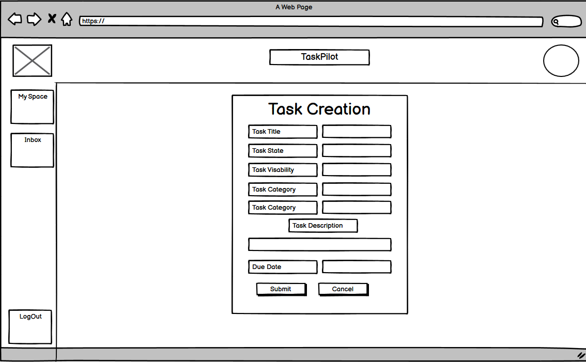
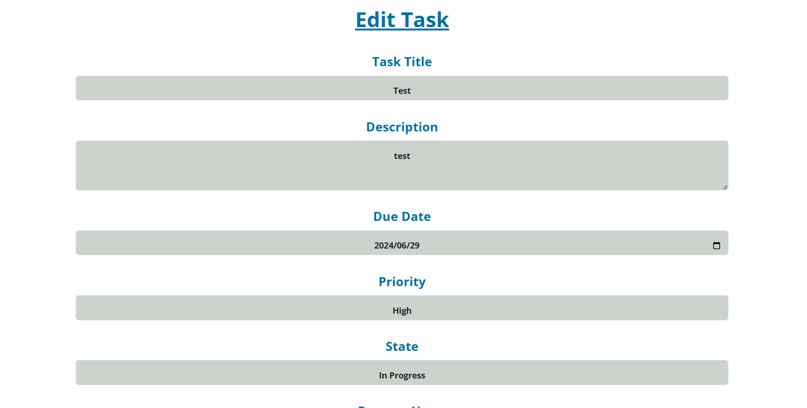
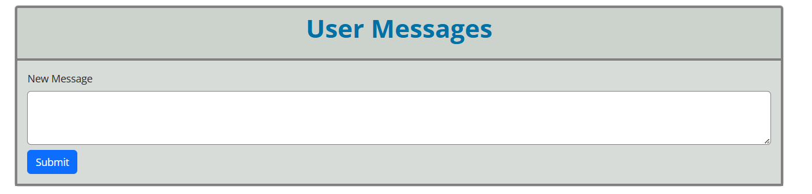
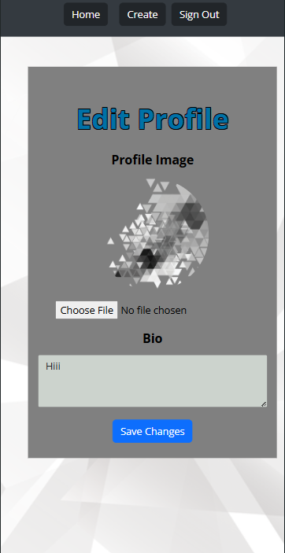
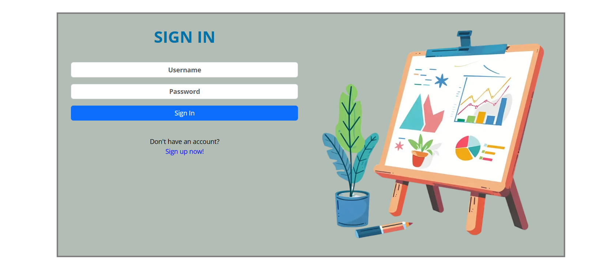
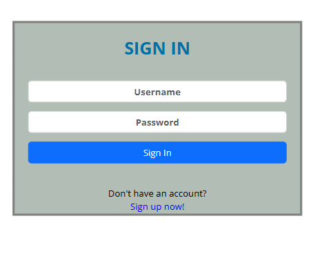

# Task Pilot
Task Pilot is a Ticket orientated application build for small to medium size business departments for managing responsibilities as a team. 

- The repository for the Task-Pilot-API associated with this project is available [HERE](https://github.com/Blaize-Egelhof/task-pilot-api). The installation, set up, and deployment steps for this section of the project have also been included in the README linked to the DRF-API. 

#### DEPLOYED BACKEND API RENDER [LINK](https://task-pilot-api-323c9bc2bc87.herokuapp.com/)
#### DEPLOYED FRONTEND RENDER [LINK - LIVE SITE](https://task-pilot-e84398da7501.herokuapp.com/)
#### DEPLOYED BACKEND GITHUB [REPOSITORY](https://github.com/Blaize-Egelhof/task-pilot-api?tab=readme-ov-file)


The live link for "Task Pilot" can be found [HERE](https://task-pilot-e84398da7501.herokuapp.com/)

## Table of Contents
+ [UX](#ux "UX")
  + [Site Purpose](#site-purpose "Site Purpose")
  + [Site Goal](#site-goal "Site Goal")
  + [Audience](#audience "Audience")
  + [Communication](#communication "Communication")
  + [Current User Goals](#current-user-goals "Current User Goals")
  + [New User Goals](#new-user-goals "New User Goals")
+ [User Stories](#user-stories "User Stories")
  + [Admin stories](#admin-stories "Admin stories")
  + [Artist stories](#artist-stories "Artist stories")
  + [Visitor stories](#visitor-stories "Visitor stories")
+ [Design](#design "Design")
  + [Colour Scheme](#colour-scheme "Colour Scheme")
  + [Typography](#typography "Typography")
  + [Imagery](#imagery "Imagery")
+ [Features](#features "Features")
  + [Existing Features](#existing-features "Existing Features")
  + [C.R.U.D](#crud "C.R.U.D")
+ [Testing](#testing "Testing")
  + [Validator Testing](#validator-testing "Validator Testing")
  + [Unfixed Bugs](#unfixed-bugs "Unfixed Bugs")
+ [Technologies Used](#technologies-used "Technologies Used")
  + [Main Languages Used](#main-languages-used "Main Languages Used")
  + [Frameworks, Libraries & Programs Used](#frameworks-libraries-programs-used "Frameworks, Libraries & Programs Used")
+ [Components](#oomponents "Components")
+ [Deployment](#deployment "Deployment")
+ [Credits](#credits "Credits")
  + [Content](#content "Content")
  + [Media](#media "Media")

## UX

### Site Purpose:
To inspire collaboration as a team in order to accomplish high difficulty Tasks / Serve as a personal Task organiser.

### Site Goal:
Inspire Collaboration , Teamwork and goal organisation for a person/'s or Organisation.

### Audience:
Anyone looking to resolve complex issues .

### Communication:
The layout is intended to represent a modern vibe, whilst at the same time having an informal feel. With the navigation panel being present at all times, the users can quickly navigate through the site to arrive at their intended destination.
This Application also has a notifcation feature in order to alert users of any state change or invite changes relating to Tasks.

### Current User Goals:
To keep users utlizing my site in order to attain further answers to Tasks or review previously answered Tasks

### New User Goals:
To engage the user in a meaningful way, and encourage them to contribute to Tasks.

### Future Goals:
- Ability to search for different Tasks according to state and ownership in order to attain answers to other Tasks site users have previously solved.
- Provide the ability for users to send private messages to either another user, or a group of users.
- Ability to verify users qualifications and contributions in order to verify weither a specific user can be marked as 'TrustWorthy' for specific Task category contributions

## User Stories
I have included links to the [GitHub Issues](https://github.com/Blaize-Egelhof/task-pilot/issues) for this project, as well as the [KANBAN board](https://github.com/users/Blaize-Egelhof/projects/3).

Please also find a full list of the Epics, User stories, & story points typed up [HERE](https://github.com/Blaize-Egelhof/task-pilot-api/blob/main/static/userstories.md).

## Design

### Wireframes:

##### Home Page - Desktop: 


##### Home Page - Mobile: 


##### Inbox Page:


##### Create Task:



##### View Task:


##### Edit Task:


##### SignUp:


##### Login:


### Database Schema:
This has been uploaded to the Backend README, which can be found [HERE](https://github.com/Blaize-Egelhof/task-pilot-api).

### Colour Scheme:


In order from left to right : 

#343a40 (Dark Gray): A strong, modern dark gray that provides a solid foundation and excellent contrast.

#0071a6 (Blue): A vibrant blue that adds a pop of color and liveliness, creating a focal point in the design.

#ccd3cd (Light Gray): A subtle, light gray that offers a gentle contrast and balances the darker tones.

#808080 (Gray): A neutral gray that serves as a versatile background, ensuring readability and a clean look.

### Typography:
I've chosen this color palette because the colors complement each other while providing subtle contrast when used in the correct order. The theme aims to be modern yet easy on the eyes, ensuring an aesthetically pleasing and user-friendly experience.

## Features

### Existing Features:

#### Header/Navigation - Desktop:


#### Header/Navigation - Mobile:


#### Home Page Navigation - Desktop:


#### Home Page Navigation -Mobile:


#### Task View - Desktop:


#### Task View - Mobile:


#### Edit Task - Desktop:



#### Edit Task - Mobile:


#### Create Task - Desktop:


#### Create Task - Mobile:


#### Create Message Send - Desktop:



#### Create Message Send - Mobile:


#### Profile View - Desktop:


#### Profile View - Mobile:


#### Profile Edit - Desktop:


#### Profile Edit - Mobile:



#### 404 - Desktop:


#### 404 - Mobile:


#### Log in, Log out & Sign up:

##### Login - Desktop:



##### Login - Mobile:



##### Logout - Desktop:


##### Logout - Mobile:


##### Sign-up - Desktop:


##### Sign-up - Mobile:


### Features Left to Implement:
- Inbox for each user to be able to recieve task invitations to accept or decline and also for notifications regarding a Task being marked as completed.
- Ability to display all public tasks created and joined via a list when viewing a profile.
- Infinite scroll for Task Messages.
- A more indepth search option to search for tasks by any criteria 
- Ability for Task admin's to pin a users comment which has solved the task's topic.

## Testing

### Manual Testing:

### Validator Testing
1. CSS files pass through the [Jigsaw validator](https://jigsaw.w3.org/css-validator/) with no issues found.


2. a. Javascript files pass through [ESLint](https://eslint.org/). The following issues were raised, and have been intentionally ignored as they are in relation to code that was provided in the Moments Walkthrough project:
 - Props spreading is forbidden
 - Do not pass children as props. 
 - Do not use Array index in keys
 - 'a_name' is already declared in the upper scope
 - Expected an assignment or function call and instead saw an expression
 - Do not nest ternary expressions
 - Fragments should contain more than one child
2. b. Additionally, this error has also been ignored:
 - Identifier 'field_name' is not in camel case 
 - - relates to a database field in the API, case cannot be changed for this reason.
2. c. All instances of errors where a newline has been asked for within an opening & closing set of tags, eg:
 - `<p>{owner} doesn't like the {drink}</p>` should be written as:
```
<p>
  {owner}
  {' '}
  doesn't like this
  {' '}
  {drink}
</p>
```
 - This particular rule does not lend to the readability of the code, & instead hinders it (in my opinion).
2. d. All `console.log(err);` have been left in place & commented out, as it was suggested that this is also done in real-world scenarios.
2. e. Added all files affected by the above, unresolved warnings to `.eslintignore`, as well as added the following line to the top of each individual file, `/* eslint-disable */` to allow for a successful deployment on Heroku.

3. The page has an excellent Accessibility rating in Lighthouse:


4. Tested the site opens in Brave, Chrome, Safari & on a mobile device without issues.

### Unfixed Bugs

- None Found

## Technologies Used
### Main Languages Used
- HTML5
- CSS3
- Javascript
- Python
- SQL - Postgres

### Frameworks, Libraries & Programs Used
- Google Fonts : For the site fonts.
- GitPod : To build the project & create the JSX & CSS files before pushing the project to Github.
- GitHub : To store my repository for submission.
- Balsamiq : Was used to create mockups of the project prior to starting.
- Am I Responsive? : To ensure the project looked good across all devices.
- Django : Used to build the backend database that serves as an API for the front-end project.
- React-Bootstrap : The styling library that has aided to the layout of the site, and which was introduced to us during the course of the program.
- ReactJS : To build the components that would collectively form the front-end application.

## Components

## Deployment
The site was deployed to Heroku. The steps to deploy are as follows:
1. Launch the gitpod workspace.
2. Install ReactJS:
```
npx create-react-app . --use-npm
npm start
```
2. Install the following packages using the command `npm install`:
```
react-bootstrap@1.6.3 bootstrap@4.6.0
react-router-dom@5.3.0
axios
react-infinite-scroll-component
msw --save-dev
jwt-decode
-g eslint
```
3. Git add, commit, and push changes to gitpod.
4. Create the project app on Heroku, and link the GitHub repository by navigating to the 'Deploy' tab.

### Connecting to the API:
1. Navigated to the Heroku app of the project DRF-API, and under the Settings tab, added the following configvars:
- Key: CLIENT_ORIGIN | Value: https://react-app-name.herokuapp.com
- Key: CLIENT_ORIGIN_DEV | Value: https://gitpod-browser-link.ws-eu54.gitpod.io
2. Check that the trailing slash `\` at the end of both links has been removed, and save the configvar pairs.
3. Install the Axios package, & create supporting `axiosDefaults.js` as shown in [Moments Walkthrough](https://github.com/Code-Institute-Solutions/moments/blob/cf955d2f2e6f70f61c92d1f9de85558d8e49f3a8/src/api/axiosDefaults.js).

### Deploy to Heroku:
1. In the `scripts` section of `package.json` in gitpod, added the following command:
```
"heroku-prebuild": "npm install -g serve",
```
2. Add Procfile to project root & populate with the following:
```
web: serve -s build
```
3. Repeat the steps of git add/commit/push.
4. Deploy the project via the deploy button on Heroku.

### Deploy to Render & ElephantSQL:
*(ElephantSQL)[https://www.elephantsql.com/] was used as a backend database provider using the following [instructions](https://code-institute-students.github.io/deployment-docs/41-pp5-adv-fe/pp5-adv-fe-drf-01-create-a-database) , (Heroku)[https://www.heroku.com/] was used to host both backend and frontend components of this project.

## Credits

### Content
- Code Institute: The creation of the project came to life by utilising the Moments walkthrough step-by-step as a base foundation, and then building upon it to make the project my own. This is evident from the numerous docstrings within my files crediting the walkthrough.
- [Lauren-Nicole](https://github.com/CluelessBiker): My mentor who helped me during the development of this project , THANK YOU FOR EVERYTHING! 

### Media
- All media was taken and used from [clean-png](https://www.cleanpng.com/)